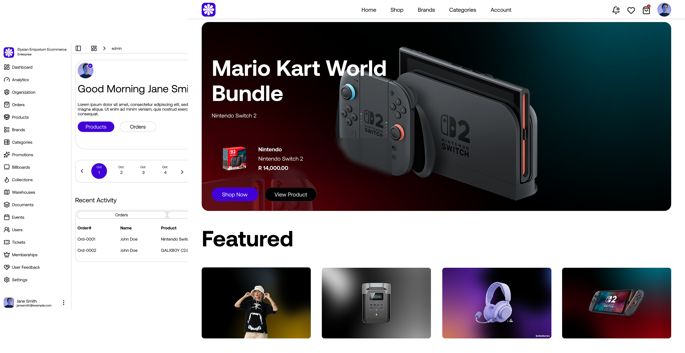

# Elysian Emporium Ecommerce Store

A modern, feature-rich ecommerce platform built with Next.js 15, TypeScript, and Prisma.

## Overview

Elysian Emporium is a full-featured ecommerce store with advanced admin capabilities, membership tiers, product management, order processing, and much more. Built with cutting-edge technologies for optimal performance and user experience.

## Resources and useful links

- Figma Design: <https://www.figma.com/community/file/1562082852012008248/elysian-emporium-ecommerce>
- Live Link: <https://elysian-emporium-ecommerce.vercel.app/>

## Tech Stack

- **Framework**: Next.js 15 (App Router with Turbopack)
- **Language**: TypeScript
- **Styling**: Tailwind CSS v4
- **Database**: PostgreSQL with Prisma ORM
- **Authentication**: Better Auth
- **UI Components**: Radix UI, ShadCN UI
- **State Management**: React Hooks
- **Animations**: Framer Motion
- **File Uploads**: UploadThing
- **Email**: Resend + React Email
- **Caching**: Upstash Redis
- **Search**: Upstash Search
- **Payments**: Multiple payment gateways (PayFast, Ozow, PayFlex)

## Key Features

### Storefront
- Responsive design for all devices
- Product browsing with categories and collections
- Advanced search and filtering
- Product reviews and ratings
- Shopping cart functionality
- Wishlist/favorites system
- Membership program with tiered benefits
- Dynamic billboards and promotional banners

### User System
- Secure authentication with Better Auth
- Membership tiers (Bronze, Silver, Gold, Platinum)
- Points-based reward system
- User profiles and order history
- Address book management
- Notifications system

### Shopping Experience
- Product variants (size, color, etc.)
- Stock management
- Multiple payment methods
- Order tracking
- Wishlist functionality
- Product comparisons

### Admin Dashboard
- Comprehensive product management
- Order processing system
- Category and brand management
- Collection and billboard management
- User management
- Membership tier administration
- Analytics and reporting
- Content management

## Project Structure

```
elysian-emporium-ecommerce-store/
├── app/                    # Next.js app router pages
│   ├── (store)/           # Public storefront pages
│   ├── admin/             # Admin dashboard pages
│   ├── api/               # API routes
│   └── auth/              # Authentication pages
├── components/            # React components
│   ├── admin/             # Admin-specific components
│   ├── store/             # Storefront components
│   └── ui/                # Reusable UI components
├── lib/                   # Library and utilities
│   ├── auth/              # Authentication setup
│   ├── prisma/            # Prisma client setup
│   └── utils/             # Utility functions
├── prisma/                # Prisma schema and migrations
├── public/                # Static assets
├── scripts/               # Utility scripts
├── styles/                # Global styles
└── types/                 # TypeScript types
```

## Getting Started

### Prerequisites
- Node.js 18+ or Bun
- PostgreSQL database
- Upstash Redis account
- Upstash Search account
- UploadThing account
- Resend account (for emails)

### Installation

1. Clone the repository:
```bash
git clone https://github.com/your-username/elysian-emporium-ecommerce-store.git
cd elysian-emporium-ecommerce-store
```

2. Install dependencies:
```bash
bun install
```

3. Set up environment variables:
```bash
cp .env.example .env
```

4. Update the `.env` file with your configuration:
```env
# Database
DATABASE_URL="your-postgresql-connection-string"

# Authentication
BETTER_AUTH_SECRET="your-auth-secret"
BETTER_AUTH_URL="http://localhost:3000"

# UploadThing
UPLOADTHING_TOKEN="your-uploadthing-token"

# Email
RESEND_API_KEY="your-resend-api-key"

# Upstash
UPSTASH_REDIS_REST_URL="your-redis-url"
UPSTASH_REDIS_REST_TOKEN="your-redis-token"
UPSTASH_SEARCH_REST_URL="your-search-url"
UPSTASH_SEARCH_REST_TOKEN="your-search-token"
```

5. Generate Prisma client:
```bash
bunx prisma generate
```

6. Run database migrations:
```bash
bunx prisma migrate dev
```

7. Seed initial data:
```bash
bun run seed
bun run seed:billboards
bun run seed:collections
```

8. Start the development server:
```bash
bun run dev
```


## Authentication

The application uses Better Auth for secure authentication with:
- Email/password login
- Social login (Google, GitHub)
- Session management
- Role-based access control
- Password reset functionality

## Payment Processing

Supports multiple payment gateways:
- Mastercard/Visa
- PayFast
- Ozow
- PayFlex
- Cash on Delivery

## Email System

Uses Resend for sending transactional emails:
- Order confirmations
- Shipping notifications
- Password reset emails
- Welcome emails
- Promotional emails

## Search & Caching

Leverages Upstash services for:
- Full-text search across products
- Redis caching for improved performance
- Real-time search suggestions

## UI/UX Features

- Dark/light mode support
- Responsive design
- Smooth animations with Framer Motion
- Interactive components
- Accessibility compliant
- Mobile-first approach

## Security

- CSRF protection
- XSS prevention
- SQL injection protection via Prisma
- Input validation with Zod
- Secure file uploads
- Rate limiting

## Performance

- Server-side rendering
- Static site generation where appropriate
- Code splitting
- Image optimization
- Asset compression
- Caching strategies

## Testing

- Unit tests with Jest
- Integration tests
- End-to-end tests with Playwright
- Type checking with TypeScript

## Deployment

The application can be deployed to:
- Vercel (recommended)
- Netlify
- AWS
- Google Cloud Platform
- Self-hosted servers


## License

This project is licensed under the MIT License - see the LICENSE file for details.

## Acknowledgments

- Next.js team for the amazing framework
- Prisma team for the excellent ORM
- ShadCN UI for beautiful components
- All the open-source contributors who made this possible


****
